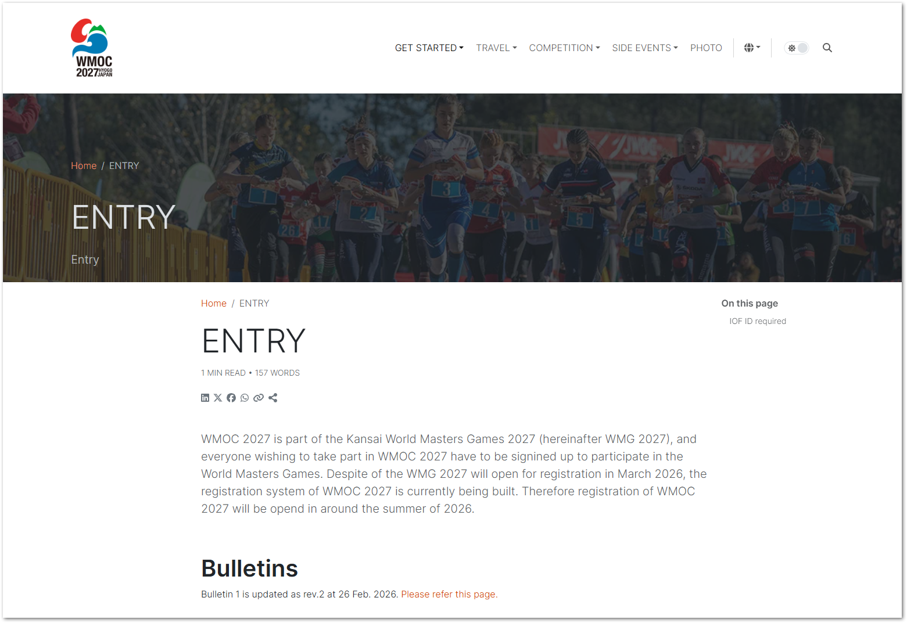

# コンテンツ

日本語と英語ページをそれぞれ下記の場所に構成し、基本的にフォルダ構成は同一にしてください。トップページの言語切り替え、または、ブラウザの言語設定により自動的に切り替わります。

* /contents/en
* /contents/ja

この下に任意のMarkdownファイルを配置します。各フォルダには `_index.md` を配置することで、そのファイルがディレクトリを指定した際のページとなります。

どのページも、基本的にページの先頭に `---` で囲ったページメタデータ設定部に、[このドキュメントのSingle Pages節にあるDefault レイアウトに従った変数](https://gethinode.com/docs/content/content-management/#single-pages)を定義することで、ページ上にその内容が表示されます。

また、これとは別に `contents_blocks` には、 [`Bookshop` のさまざまなフレームワークレイアウト](https://gethinode.com/docs/blocks/)を組み込むことができます。ほとんどすべてのページには次のような[ヒーローバナーを表示するHero Block](https://gethinode.com/docs/blocks/hero/)を定義しています。これにより背景イメージにページタイトルとパンくずリストを表示するヘッダの帯が表示されます。

~~~~ markdown
---
title: ENTRY
description: WMOC 2027 is part of the Kansai World Masters Games 2027 (hereinafter WMG 2027), and everyone wishing to take part in WMOC 2027 have to be signined up to participate in the World Masters Games. Despite of the WMG 2027 will open for registration in March 2026, the registration system of WMOC 2027 is currently being built. Therefore registration of WMOC 2027 will be opend in around the summer of 2026.
icon: fas door-open
content_blocks:
  - _bookshop_name: hero
    heading:
      title: ENTRY
      align: start
      content: Entry
      width: 8
    background:
      backdrop: /image/2022_jwoc_relay1_susana_luzir.jpg
    breadcrumb: true
---

# Bulletins

Bulletin 1 is updated as rev.2 at 26 Feb. 2026.  Please refer this page. 

~~~~

このページは下記のとおり表示されます。

任意のブロックが必要であれば、このあと続けて `_bookshop_name: `に続けて任意のBookshop名を指定したブロックを追加することが可能です。

## コンテンツツリー構成

各言語ツリー以下は次の構成となっており、このままURLに結びつきます。

competitions
    : WMOC2027競技関連のコンテンツを配置するディレクトリです。
    : bulletins
        : 要項、プログラムを案内する場所です。
    : results
        : 大会の競技結果を案内する場所です。
    : startlists
        : スタートリストを案内する場所です。

get_started
    : はじめてWMOC2027に参加したいと思われる方向けの情報を提供する場所です。スケジュールとエントリー方法の案内が主な情報となります。
    : entry
        : エントリーに関する概要を案内しています。
    : schedule
        : Content blockにおいて、bookshopのreleaseモジュールを使った時系列イベントチャートを表示します。時系列イベントチャートのコンテンツは、`/data/timeline.**.yaml` （**部分は言語サイン）ファイルとしてyaml形式で定義します。

joint_events
    : 関連イベントに関する情報を配置する場所です。
    : pre_events
        : WMOC2027実行委員会が主催・主管するイベントを格納する場所です。
    : orienteering_in_japan
        : 海外からの来訪者向けに、WMOC2027以外のテレインを広く楽しんでもらうためのコンテンツを提供する場所です。Navi-tabiや、その他、各都道府県協会やクラブが提供する情報に基づいてイベント案内を行います。

posts
    : ブログ記事（Our activities / 活動報告）の記事を格納する場所です。

registration
    : エントリーに関する詳細情報を格納する場所です。

travel
    : 交通、宿泊、観光に関する情報を格納する場所です。