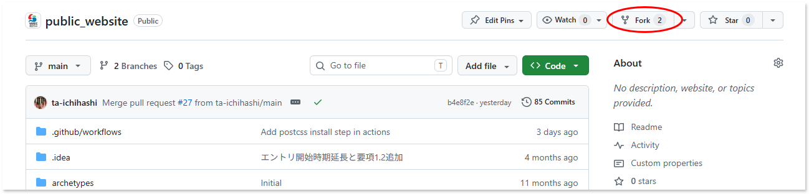
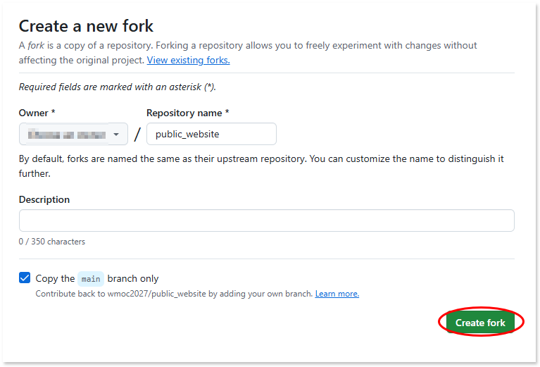
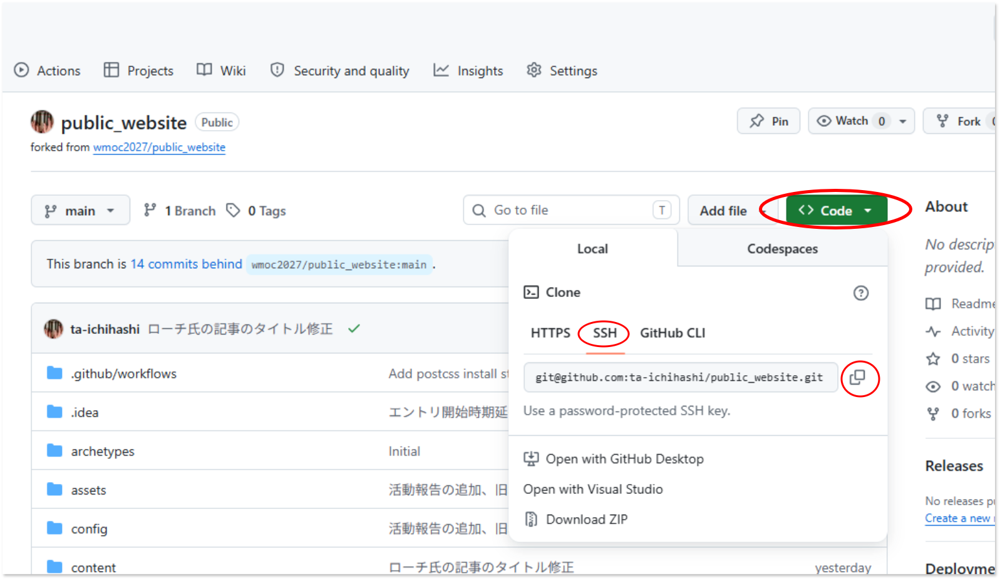
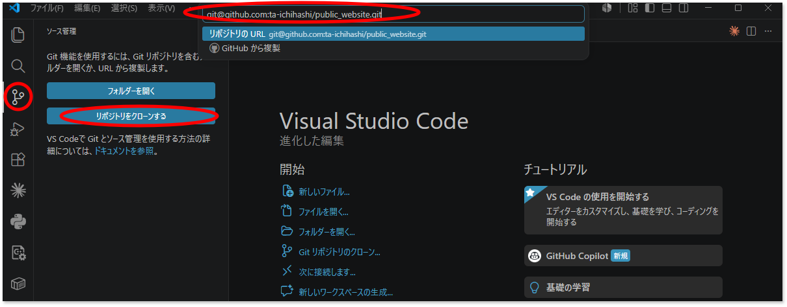
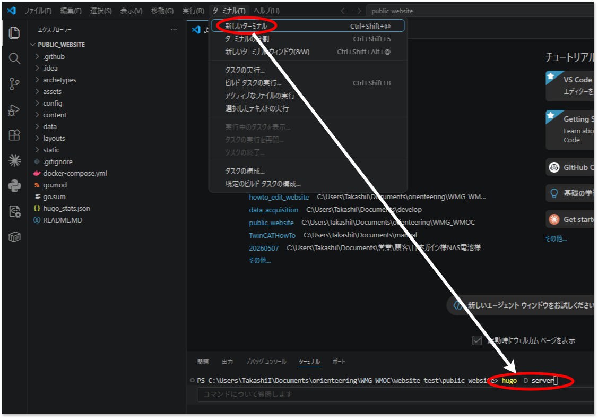

# Githubアカウント作成とリポジトリ準備

## アカウント作成

1. こちらを参考にしてGithubアカウントを作成してください。

    ```{button-link} https://docs.github.com/ja/get-started/start-your-journey/creating-an-account-on-github
    :color: primary
    :outline:

    {fab}`github` Github アカウントの作成
    ```

2. アカウントを作成したら、WEBページ管理者へ該当アカウントをメールでお伝えください。[wmoc2027組織アカウント](https://github.com/orgs/wmoc2027/people) へメンバー登録を行います。
   
## SSH公開鍵の登録

1. PC上でコマンドターミナルを起動し、次のコマンドを発行します。

    ```{code-block} powershell
    ssh-keygen -t ed25519 -C "email@example.com"
    ```
    `email@example.com` の部分はあなたのメールアドレスとしてください。

    ```{code} powershell
    Generating public/private rsa key pair.
    Enter file in which to save the key (/c/Users/????/.ssh/id_rsa):
    Enter passphrase (empty for no passphrase):
    Enter same passphrase again:
    ```

    途中でプロンプトで入力を求められますが、すべてリターンのみ入力してください。

    `%HOMEPATH%` (`C:\Users\****`) 以下に `.ssh` フォルダができています。この下にある `id_rsa.pub` ファイルが公開鍵ファイルです。これをテキストエディタで開いて内容を全てクリップボードに記憶させてください。次手順に示すGithubの設定で、アカウントにssh公開鍵を登録します。

    クリップボードへの出力は次のコマンドでも実行可能です。

    ```{code}
    clip < %HOMEPATH%\.ssh\id_rsa.pub
    ```

2. Githubのあなたのアカウントへ公開鍵を登録します。

    右上アイコンから`Settings`を選択し、左側のメニューから`SSH and GPG keys`を選択し、`New SSH Key`ボタンを押します。

    {align=center}

    Titleフィールドに接続する端末がわかる名称を記入し、Keyにクリップボードを貼り付け、最後に`Add SSH Key`ボタンを押します。
    {align=center}

## 自分のアカウントへのフォーク


1. [https://github.com/wmoc2027/public_website](https://github.com/wmoc2027/public_website)にアクセスし、自分のアカウントにフォークします。

    {align=center}

    {align=center}

2. Forkしたリポジトリを、自分のPCへクローンします。まずは、SSHのパスをコピーします。

    {align=center}

3. VSCodeを開き、ソース管理から先ほどコピーしたSSHパスを使ってクローンを実施します。

    {align=center}

    1. コピーしたURLを入力
    2. SSHの秘密鍵作成時にパスフェーズを設定した場合、その文字列を入力
    3. エクスプローラにて保存する空のフォルダを指定
    4. 開きますか？と聞かれるので、はいを選ぶとクローンしたソースをVSCodeで開きます

## 文書ソースを編集しブラウザでプレビューを確認する

VSCodeの上部メニュー「ターミナル」メニューからターミナルを開き、次のコマンドを入力します。

```{code} powershell
hugo -D server
```

{align=center}


コマンドを入力するとビルドが行われます。`WARN`メッセージがいくつか出ますが問題ありません。`ERROR` は問題があるのでソースファイルの修正が必要です。すべて正常にビルドが終了すると下記のとおり最後にURL `http://localhost:1313` が現れます。このURLをブラウザで開くと、編集中のソースがHTMLに変換されたプレビューが表示されます。

```{code}
WARN  deprecated: .Site.Languages was deprecated in Hugo v0.156.0 and will be removed in a future release. See https://discourse.gohugo.io/t/56732.
WARN  site parameter "navigation.search": deprecated in v1.12.0, use "navigation.search.enabled" instead
WARN  site parameter "navigation.searchModal": deprecated in v1.12.0, use "navigation.search.modal" instead
WARN  deprecated: .Language.LanguageName was deprecated in Hugo v0.158.0 and will be removed in a future release. Use .Language.Label instead.

                  │ EN  │ JA  
──────────────────┼─────┼─────
 Pages            │  52 │  53 
 Paginator pages  │   0 │   0 
 Non-page files   │   0 │   0 
 Static files     │ 282 │ 282 
 Processed images │ 146 │   0 
 Aliases          │   2 │   2 
 Cleaned          │   0 │   0 

Built in 7332 ms
Environment: "development"
Serving pages from disk
Running in Fast Render Mode. For full rebuilds on change: hugo server --disableFastRender
Web Server is available at http://localhost:1313/ (bind address 127.0.0.1) 
Press Ctrl+C to stop
```

```{note}
キーボードでCtrl＋Cを押すまでは、以後、VSCodeでソースファイルのディレクトリを保存するたびに自動再ビルドが行われ、一度開いたブラウザを再描画します。

このように、一連の編集を行い、プレビューで出来栄えを確認し、問題なければGitでコミットします。コミットする単位は単一の理由としてください。複数の理由による変更を一度のコミットにまとめてしまうと、あとから変更の追跡が難しくなります。
```

## プッシュとプルリクエスト

VSCode上でプッシュ操作を行います。クローンした元であるご自分のGithubのリポジトリに反映されます。このあと、プルリクエストを行うことで、フォーク元である公式サイトへ反映されます。
